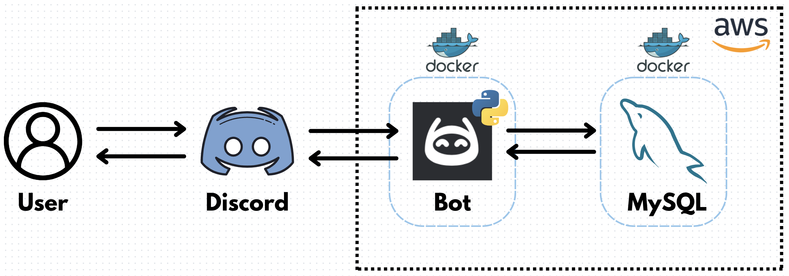

# trivia-discord-bot
A fun Discord bot that inquires trivia questions for users to interact with. Users can start a quiz to begin the game and find out their score.

Final project designed for *CSCI 220.2: Intro to DevOps.*

## System Architecture


### Commands:
- `ping` - The bot responds with `"pong!"`
- `whoami` - The bot responds with `"You are [YOUR USERNAME]!"`
- `start quiz` - The bot begins a brief 5-question quiz. It tells you your final score at the end of it.

### Contributers:
- [Christine Colvin](https://github.com/christinecolvin)
- [Jack Drabic](https://github.com/JackJack7890)
- [Rafael Garcia Jr.](https://github.com/RGJ-713)
- [Michael Romero](https://github.com/MichaelRomero1)

### Prerequisites:

- Amazon Web Services (AWS) | ([Website](https://aws.amazon.com/?nc2=h_lg))
- Discord | ([Website](https://discord.com))
- MySQL | ([Download](https://dev.mysql.com/downloads/mysql/), [Set-Up Tutorial](https://dev.mysql.com/doc/mysql-getting-started/en/))

### References:
- [How to Make a Discord Bot in Python](https://realpython.com/how-to-make-a-discord-bot-python/) by Alex Ronquillo

## Creating A Discord Bot

### 1. Create a new bot in Developer Portal
Go to the [Discord Developer Portal](https://discord.com/developers/applications) and click the **New Application** button to create a new Discord bot.

### 2. Set bot permissions
Once a new bot has been created, locate the **Bot** tab on the left-hand side of the **Settings**.

Locate the "**Privileged Gateway Intents**" section and enable "**Message Content Intent**" to allow your bot to receive and read messages.

After being enabled, select the permissions you want your bot to have.

### 3. Obtain your bot's Discord token
In order for your bot to properly run, you will need to obtain your bot's token.

In the **Bot** tab, locate the **Build-A-Bot** section. Locate the **Token** portion and press the **Reset Token** button to reset and obtain your bot's Discord token.

***Note:** Tokens can only be viewed once. Be sure to save your token somewhere safe, as if you ever need it again, you will need to generate a new one.*

### 4. Add your bot to your Discord server
Locate the **OAuth2** tab on the left-hand side of the **Settings**.

Under the **OAuth2 URL Generator** section, select "**bot**" under **Scopes**.

A new tab will open below. Select the permissions you want your bot to have.

Once done, locate **Generated URL** and press the **Copy** button to gain a link to add your bot to your preferred Discord server.

Go to that URL and select the Discord server(s) you want to add the bot to.

# Local Installation Tutorial

### 1. Clone the repo
Once you are all set up, press the green **<> Code** button to gain a link to clone the repository.

Then, open your preferred [IDE](https://aws.amazon.com/what-is/ide/) or a [Command Line Interface](https://en.wikipedia.org/wiki/Command-line_interface#:~:text=A%20command%2Dline%20interface%20\(CLI,interface%20available%20with%20punched%20cards.) and clone the repository with the following command:

```
git clone https://github.com/cs220s24/trivia-discord-bot.git
```

### 2. Run `setup_bot_local.sh`
Go into your preferred terminal and enter the **`trivia-discord-bot`** repository.

Run the following command:

```
sh setup_bot_local.sh
```

Follow the instruction prompts given in the terminal. This will complete all the necessary set-up for the bot to run.

### 3. Run the bot
The bot should now successfully be up and running!

You can test this by posting the message **`ping`**. The bot should respond with **`"pong!"`**.

To play a brief quiz with the bot, post the message **`start quiz`**.

# AWS EC2 Instance Installation Tutorial (without Docker)

### 1. Create a new EC2 instance
If you haven't already, create a new EC2 instance on [Amazon Web Services](https://aws.amazon.com/?nc2=h_lg).

Once created, `ssh` into the instance in a [Command Line Interface](https://en.wikipedia.org/wiki/Command-line_interface#:~:text=A%20command%2Dline%20interface%20\(CLI,interface%20available%20with%20punched%20cards.) with the following command:

```
ssh -i ~/.ssh/labsuser.pem ec2-user@<PUBLIC IPv4 ADDRESS HERE>
```

### 2. Clone the repo
Once you are all set up, install `git` in the EC2 instance with the following command:

```
sudo yum install -y git
```

Afterwards, press the green **<> Code** button to gain a link to clone the repository.

Then, in your Command Line Interface, clone the repository with the following command:

```
git clone https://github.com/cs220s24/trivia-discord-bot.git
```

### 3. Run `setup_bot_EC2.sh`
Now, enter the **`trivia-discord-bot`** repository in the EC2 instance.

Run the following command:

```
sh setup_bot_EC2.sh
```

Follow the instruction prompts given in the terminal. This will complete all the necessary set-up for the bot to run.

### 4. Run the bot
The bot should now successfully be up and running on the EC2 instance!

You can test this by posting the message **`ping`**. The bot should respond with **`"pong!"`**.

To play a brief quiz with the bot, post the message **`start quiz`**.

# AWS EC2 Instance Installation Tutorial (with Docker)

### 1. Create a new EC2 instance
If you haven't already, create a new EC2 instance on [Amazon Web Services](https://aws.amazon.com/?nc2=h_lg).

Once created, `ssh` into the instance in a [Command Line Interface](https://en.wikipedia.org/wiki/Command-line_interface#:~:text=A%20command%2Dline%20interface%20\(CLI,interface%20available%20with%20punched%20cards.) with the following command:

```
ssh -i ~/.ssh/labsuser.pem ec2-user@<PUBLIC IPv4 ADDRESS HERE>
```

### 2. Clone the repo
Once you are all set up, install `git` in the EC2 instance with the following command:

```
sudo yum install -y git
```

Afterwards, press the green **<> Code** button to gain a link to clone the repository.

Then, in your Command Line Interface, clone the repository with the following command:

```
git clone https://github.com/cs220s24/trivia-discord-bot.git
```

### 3. Run `AWS_deploy.sh`
Now, enter the **`trivia-discord-bot`** repository in the EC2 instance.

Run the following command:

```
sh AWS_deploy.sh
```

Follow the instructions given in the terminal.

***Note:** You will have to log out and log back in to the EC2 instance to apply the changes made by the script.*

### 4. Run `build.sh`
Once you've logged back in, enter the repository again and run the following command:

```
sh build.sh
```

Follow the instruction prompts given in the terminal. This will build the docker images for the containers that the bot will use to run.

### 5. Run `./up` to start the bot
The bot should now successfully be ready to run on the EC2 instance!

Type in the following command to **start up** the containers:

```
./up
```

This may take a moment (approximately 20 seconds), so just be patient if the bot doesn't immediately connect to the database.

Type in the following command to **stop and remove** the containers:

```
./down
```

# Additional Info

### `.env` file
Each script automatically creates a `.env` file to hold your credentials. Should you feel the need to create this manually, the `.env` must contain the following:
```
DISCORD_TOKEN=<DISCORD BOT TOKEN HERE>
DISCORD_GUILD=<DISCORD SERVER NAME HERE>
MYSQL_USERNAME=<MySQL USERNAME HERE>
MYSQL_ROOT_PASSWORD=<MySQL ROOT PASSWORD HERE>
MYSQL_HOST=<MySQL HOST NAME HERE>
```

### Manual Systemd Commands
These steps can be used locally to copy the `discord_bot.service` file to the `system` path to run it on systemd:
```
sudo cp discord_bot.service /etc/systemd/system
```
```
sudo systemctl enable discord_bot.service
```
```
sudo systemctl start discord_bot.service
```

# Developer Workflow
- Git and GitHub was utilized to effectively push updated code and allow team members to be able to work on individual tasks.
- Discord calls were made to collaborate and update each other on important changes to the project.
- Peer review of pushed code was frequent, as well as testing the code that others pushed (such as the scripts) to make sure everything worked.
  
- In order to start making contributions on the project, you have to:
    - Clone the repository
    - Create a virtual environment and make the necessary installations with:
      
      ```
      python3 -m venv .venv
      source .venv/bin/activate
      pip install -r requirements.txt
      ```

    - Create a `.env` file with the necessary information:
 
      ```
      DISCORD_TOKEN=<DISCORD BOT TOKEN HERE> (This will be specific to the Discord bot being developed. In order to develop our Discord bot, you would have to request the Discord bot token from one of us.)
      DISCORD_GUILD=<DISCORD SERVER NAME HERE> (This will be specific to the Discord server you want to connect the bot to.)
      MYSQL_USERNAME=<MySQL USERNAME HERE> (This is the username that you will be using to log into MySQL.)
      MYSQL_ROOT_PASSWORD=<MySQL ROOT PASSWORD HERE> (This is the password that you will be using to log into MySQL.)
      MYSQL_HOST=<MySQL HOST NAME HERE> (This is the host MySQL will connect to. This will be "localhost" if you are running it locally.)
      ```

- Now, you can successfully make contributions to the Discord Trivia Bot!
